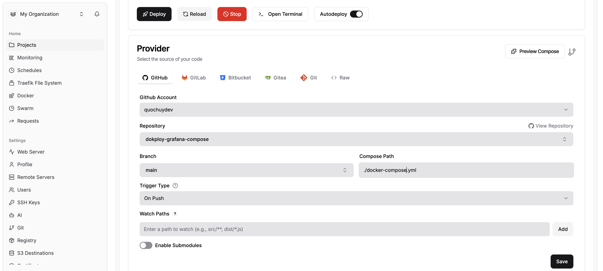
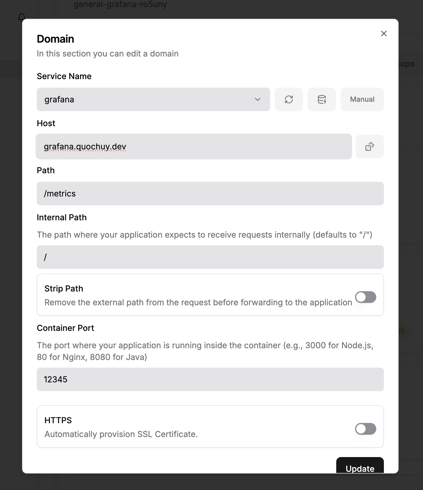
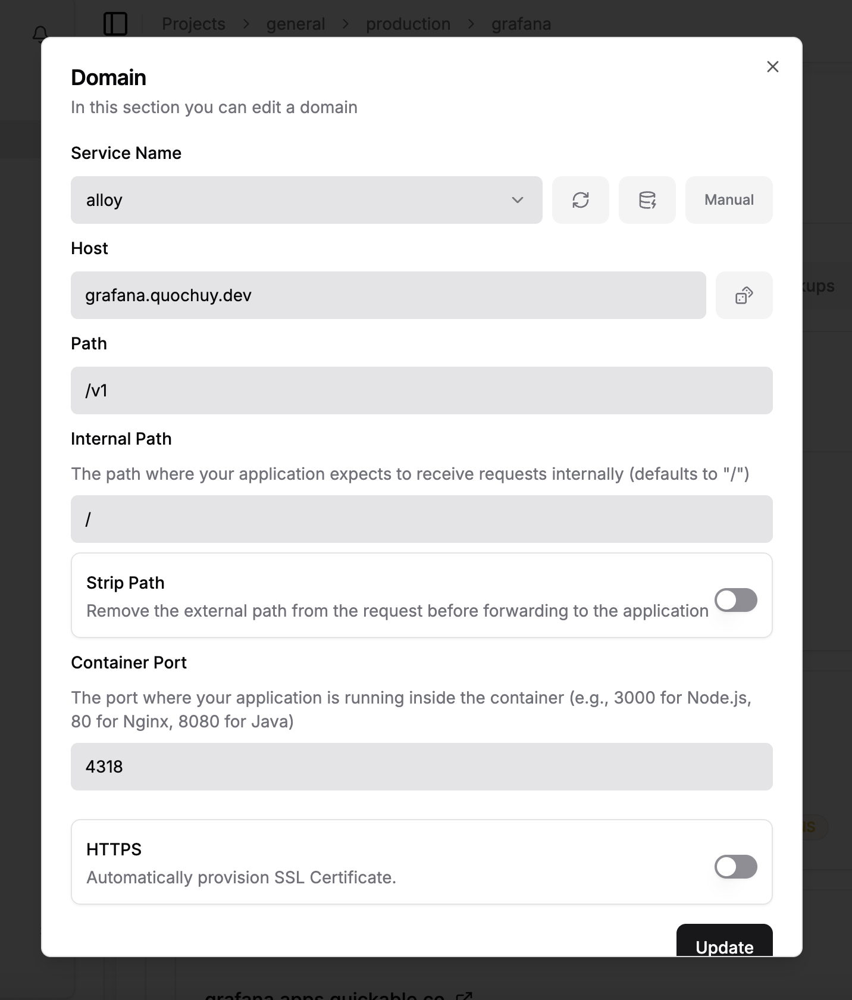
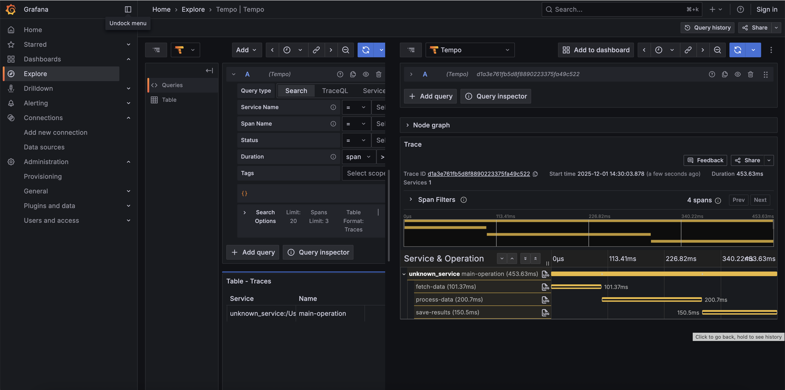

# Dokploy Grafana Monitoring Stack

A complete observability stack with **Grafana**, **Tempo**, **Loki**, and **Grafana Alloy** for distributed tracing, logging, and metrics collection. Designed to work seamlessly with Dokploy's Docker network.







## Overview

This stack provides a production-ready monitoring solution with:

- **Grafana Alloy**: Unified collector for traces, logs, and metrics (OTLP & Faro receivers)
- **Tempo**: High-scale distributed tracing backend
- **Loki**: Log aggregation and querying
- **Grafana**: Visualization and correlation of traces, logs, and metrics

## Tracing



## Configuration

### OTLP Endpoints

**HTTP (recommended)**:

```
http://localhost:4318/v1/traces
http://localhost:4318/v1/metrics
http://localhost:4318/v1/logs
```

**GRPC**:

```
localhost:4317
```

## Sending Traces with curl

### Send a Test Trace

```bash
curl -X POST http://localhost:4318/v1/traces \
  -H "Content-Type: application/json" \
  -d '{
    "resourceSpans": [{
      "resource": {
        "attributes": [{
          "key": "service.name",
          "value": { "stringValue": "curl-test-service" }
        }]
      },
      "scopeSpans": [{
        "scope": {
          "name": "manual-test"
        },
        "spans": [{
          "traceId": "5b8efff798038103d269b633813fc60c",
          "spanId": "eee19b7ec3c1b174",
          "name": "test-operation",
          "kind": 1,
          "startTimeUnixNano": "1609459200000000000",
          "endTimeUnixNano": "1609459200100000000",
          "attributes": [{
            "key": "http.method",
            "value": { "stringValue": "GET" }
          }, {
            "key": "http.url",
            "value": { "stringValue": "http://example.com/api" }
          }]
        }]
      }]
    }]
  }'
```

### Send Logs via OTLP

```bash
curl -X POST http://localhost:4318/v1/logs \
  -H "Content-Type: application/json" \
  -d '{
    "resourceLogs": [{
      "resource": {
        "attributes": [{
          "key": "service.name",
          "value": { "stringValue": "curl-log-service" }
        }]
      },
      "scopeLogs": [{
        "scope": { "name": "manual-log" },
        "logRecords": [{
          "timeUnixNano": "1609459200000000000",
          "severityNumber": 9,
          "severityText": "INFO",
          "body": { "stringValue": "Test log message from curl" },
          "attributes": [{
            "key": "log.level",
            "value": { "stringValue": "info" }
          }]
        }]
      }]
    }]
  }'
```

### Send Metrics via OTLP

```bash
curl -X POST http://localhost:4318/v1/metrics \
  -H "Content-Type: application/json" \
  -d '{
    "resourceMetrics": [{
      "resource": {
        "attributes": [{
          "key": "service.name",
          "value": { "stringValue": "curl-metrics-service" }
        }]
      },
      "scopeMetrics": [{
        "scope": { "name": "manual-metrics" },
        "metrics": [{
          "name": "http_requests_total",
          "description": "Total HTTP requests",
          "unit": "1",
          "sum": {
            "dataPoints": [{
              "asInt": "42",
              "timeUnixNano": "1609459200000000000"
            }],
            "aggregationTemporality": 2,
            "isMonotonic": true
          }
        }]
      }]
    }]
  }'
```

### Query Tempo for Traces

```bash
# Search for traces by service name
curl "http://localhost:3200/api/search?tags=service.name=curl-test-service"

# Get specific trace by ID
curl "http://localhost:3200/api/traces/5b8efff798038103d269b633813fc60c"
```

### Query Loki for Logs

```bash
# Query logs (LogQL)
curl -G "http://localhost:3100/loki/api/v1/query" \
  --data-urlencode 'query={job="app-name"}' \
  --data-urlencode 'limit=10'

# Query logs in range
curl -G "http://localhost:3100/loki/api/v1/query_range" \
  --data-urlencode 'query={job="app-name"}' \
  --data-urlencode 'start=1609459200000000000' \
  --data-urlencode 'end=1609459260000000000'
```

## Data Retention

- **Tempo**: 48 hours of trace data
- **Loki**: 31 days of log data
- **Metrics**: Stored in Tempo's Prometheus-compatible endpoint

## Troubleshooting

### Test OTLP Endpoint

```bash
# Check Alloy health
curl http://localhost:12345/metrics

# Check Tempo health
curl http://localhost:3200/ready

# Check Loki health
curl http://localhost:3100/ready
```

## License

MIT License - see [LICENSE](LICENSE) file for details.

## Contributing

Contributions are welcome! Please open an issue or submit a pull request.

## Links

- [Grafana Documentation](https://grafana.com/docs/)
- [Tempo Documentation](https://grafana.com/docs/tempo/)
- [Loki Documentation](https://grafana.com/docs/loki/)
- [Grafana Alloy Documentation](https://grafana.com/docs/alloy/)
- [OpenTelemetry Documentation](https://opentelemetry.io/docs/)
- [Dokploy Documentation](https://dokploy.com/)
